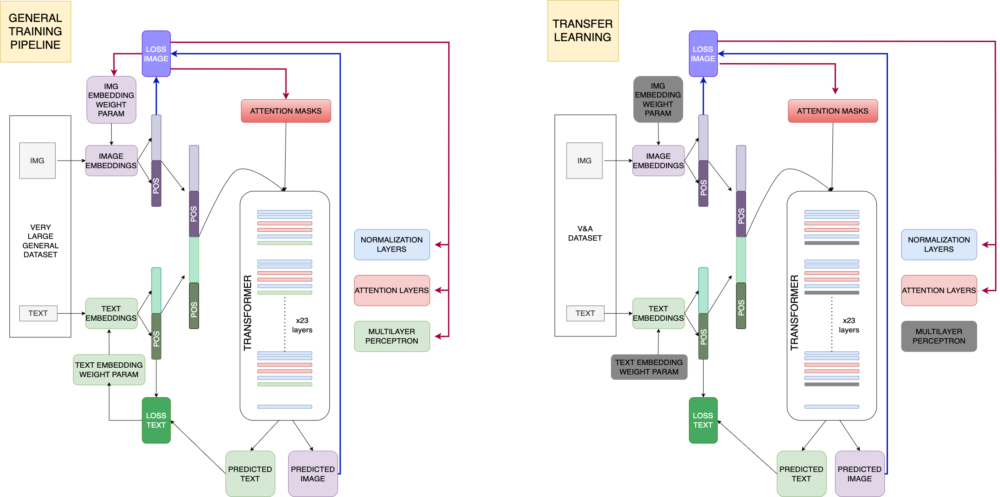

## Welcome to the GitHub page of the *V&A Design generator project.*

The Design Generator project is a collaboration between the Vasari Research Centre for Art and Technology, the Birkbeck Institute for Data Analytics (BIDA), and the V&A Museum. 

This public engagement initiative will involve extensive experimentation with current Machine Learning algorithms and Neural Network technology to develop an interactive tool for exploring the styles and characteristics of objects in the V&A's collection. 

The primary planned outcome of the project will be a "Design Generator" tool that allows members of the public to combine key terms from the V&A's collection categories (periods, styles, materials, techniques, etc.) in order to generate images of new, imagined museum objects. 

For example, the user of the tool might choose to combine terms such as "art nouveau" and "stained glass," or "surrealism" and "tapestry" to produce new, perhaps even improbable objects. 

The AI tool aims to encourage creative learning and exploration of the defining characteristics of the key periods, styles and materials around which the design museum is organized.

The project actively seeks the help of the public and will culminate in a public-engagement workshop involving a pilot panelmade up of 8 members of the V&A public. 

The hands-on workshop will introduce participants to the capabilities of AI technologies and their current and potential use within the arts
and the museum sector. 

The workshop will also provide participants with an opportunity to trial the prototype Design Generator application and provide feedback on its development

### The pipeline

The schema below describes the current pipeline of our generator; it evolves as data sourcing from the V&A become available.
Currently the project is running over the [ruDALL-E](https://github.com/ai-forever/ru-dalle) pre-trained branch of [DALL-E](https://openai.com/dall-e-2/) to kick-start its architecture.

### The team

Our work is funded by [UKRI/AHRC](https://www.ukri.org/councils/ahrc/) via the CapCo call and supported by the [Victoria and Albert Museum](https://www.vam.ac.uk/).

This project is led by [Dr Joel McKim](https://www.bbk.ac.uk/our-staff/profile/8005964/joel-mckim)  directory of the [Vasari Centre for Arts and Technology](http://www7.bbk.ac.uk/vasari/) from Birkbeck, University of London, [Dept. of Film, Media and Cultural Studies](https://www.bbk.ac.uk/departments/culture).

Further members are co-PI [Dr Alessandro Provetti](https://www.bbk.ac.uk/our-staff/profile/8005964/joel-mckim) from Birkbeck, University of London Dept. of Copmputer Science and Information System, [Daphne Demekas](https://github.com/daphnedemekas) and [Josephine Lawson-Tancred](https://github.com/JoLawsonTancred).

